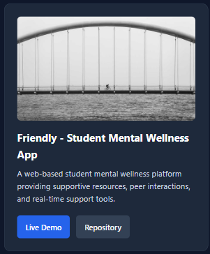
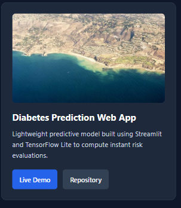

**Live Portfolio URL:** https://vinaysingh-05.github.io/AI-Fluency-FlyRankAI-internship/

### Mobile & Responsiveness Fix Log

**Before / After Proof:**
- **Before Fixes:**
  

- **After Fixes:**
  

---

### Key Issues Found & Resolved

1. **Mobile Spills & Image Scaling:**
   - **Problem:** Images spilled horizontally beyond screen width on 375px–414px mobile viewports.
   - **Fix:** Applied `max-width: 100%` and `height: auto` to card image CSS rules.

2. **Typography & Touch Targets:**
   - **Problem:** Small font size and tight button spacing on phone screens.
   - **Fix:** Increased base font to `16px` (`1rem`) and button heights to `44px` minimum tap targets.

3. **Link Verification:**
   - **Problem:** Missing target attributes and unverified demo URLs.
   - **Fix:** Pointed all demo and repository buttons to active destinations.
